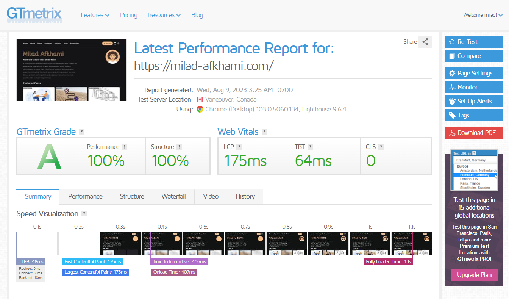
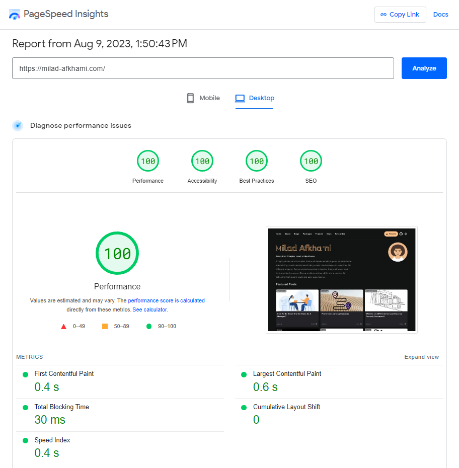
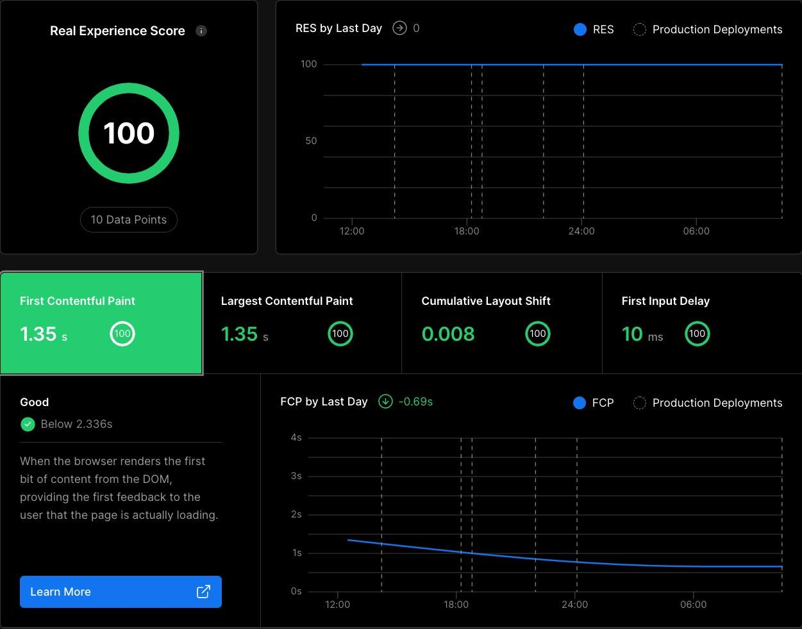
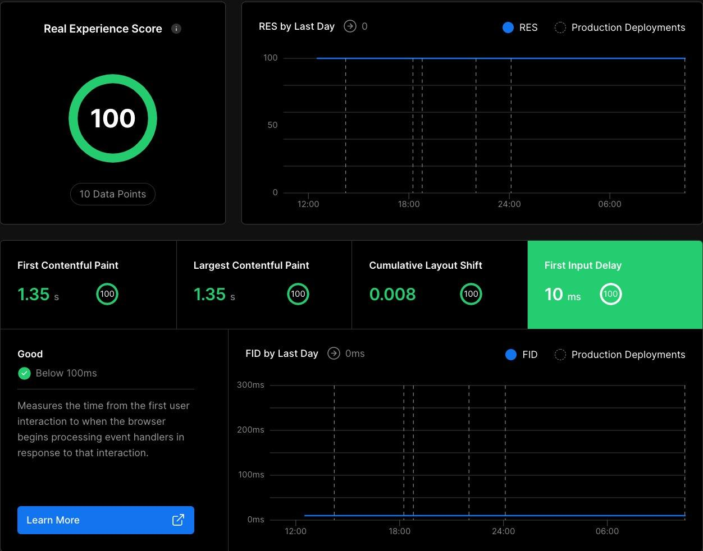

[React.js]: https://react.dev
[Next.js]: https://nextjs.org
[MDX]: https://github.com/mdx-js/mdx
[goober]: https://goober.js.org
[Vercel]: https://vercel.com
[not coffee]: https://www.healthline.com/nutrition/caffeine-side-effects
[jsdoc]: https://jsdoc.app
[style-wiz]: https://www.npmjs.com/package/style-wiz
[milad-afkhami.com]: https://milad-afkhami.com
[jest]: https://jestjs.io
[React Testing Library]: https://testing-library.com/docs/react-testing-library/intro
[eslint]: https://eslint.org
[Husky]: https://typicode.github.io/husky
[Commitlint]: https://commitlint.js.org
[Vercel]: https://vercel.com/
[Scripts]: ./docs/scripts.md
[Font Icons]: ./docs/font-icons.md
[Code Splitting]: ./docs/style-guide/code-splitting.md
[Folder Structure]: ./docs/style-guide/folder-structure.md
[JavaScript Style Guide]: https://github.com/airbnb/javascript
[React Style Guide]: https://github.com/airbnb/javascript/tree/master/react
[Import Priority]: ./docs/style-guide/import-priority.md

# My portfolio website

## [milad-afkhami.com] 🔗

Made with [React.js], [Next.js], and [style-wiz] but [not coffee]. Used [Vercel] for deployments since it is highly featured and easily configurable with Next.js.

## 1. Features 💪🏻

⚡️ No component with more than 100 lines of code except index.css with CSS reset principals.
You can run this command `git ls-files | xargs wc -l | awk '$1 > 100'` in project repository to see it in action. \
⚡️ Multi theme structure using [style-wiz]. \
⚡️ Multi language implementation with support for Deutsch and French aside from english. \
⚡️ Using ISR(on-demand revalidation), SSG for data fetching as latest technologies as I described [here](https://milad-afkhami.com/blog/data-fetching-pattern-preference). \
⚡️ Global and responsive typography using [style-wiz]. \
⚡️ Enhanced static typing with typescript. \
⚡️ Documented with [jsdoc]. \
⚡️ Tested with [jest] and [React Testing Library]. \
⚡️ Statically analyzed with strict [eslint] plugins(@typescript-eslint/eslint-plugin, eslint-config-airbnb-typescript, eslint-config-next, and ...). \
⚡️ Enhanced code checks using git hooks from [Husky]. \
⚡️ Adhered to conventional commit messages using [Commitlint]. \
⚡️ Enhanced developer experience using bash scripts for operation commands. \
⚡️ Comprehensive documentations about style guide and implementations. \

<!-- #TODO Making courses on youtube, walking through this repository -->

## 2. Analytic Reports 📐




<!-- |||
| :--: | :--: |
|  |  |
|  |  | -->

## 3. Prerequisites

- Through knowledge of Modern JavaScript, React.js, and Next.js.

## 4. Environment

- Node.js version upper than or equal to 16.x
- Yarn 1.22.x
- Terminal (one of)
  - Git bash in windows
  - Command line in Linux
- Using anything other than these configurations might cause problems with the below functionalities and I don't recommend it.
  - scripts
  - git hooks

## 5. Setup

```bash
git clone https://github.com/milad-afkhami/portfolio.git
cd portfolio
yarn install
yarn dev
```

## 6. [Scripts]

## 7. Style Guide

### 7.1. [Code Splitting]

### 7.2. [Folder Structure]

### 7.3. [JavaScript Style Guide]

### 7.4. [React Style Guide]

### 7.5. [Import Priority]

## 8. Stylesheets

### 8.1. Global Styles

I use [style-wiz] for global stylesheets

### 8.2. CSS-in-JS

I also use [style-wiz] for CSS-in-JS.

### 8.3. [Font Icons]
