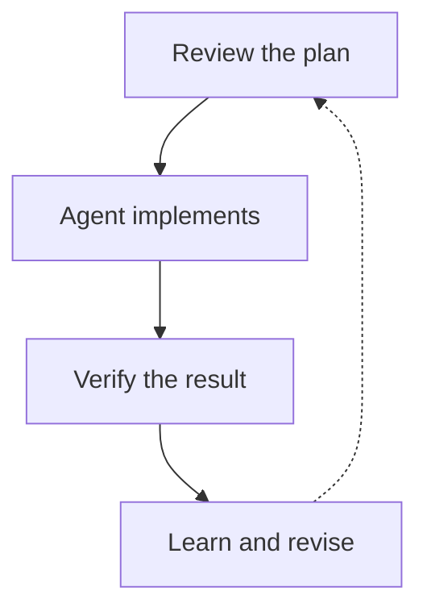

# Milad Afkhami's Portfolio

A modern portfolio website built with Next.js, TypeScript, and Tailwind CSS.

## Technologies Used

- TypeScript (Strictly typed)
- ESLint
- Prettier
- Commitlint
- Tailwind CSS
- Daisy UI
- React.js
- Next.js (App Router)

## Getting Started

1. Clone the repository
2. Install dependencies:
   ```bash
   npm install
   ```
3. Copy `.env.example` to `.env.local` and fill in the required environment variables
4. Run the development server:
   ```bash
   npm run dev
   ```
5. Open [http://localhost:3000](http://localhost:3000) in your browser

## Project Structure

- `app/`: Next.js app directory
- `components/`: React components
- `configs/`: Configuration files
- `constants/`: Constants
- `containers/`: Container components
- `data/`: Data files
- `docs/`: Documentation files
- `helpers/`: Helper functions
- `hooks/`: Custom hooks
- `public/`: Public assets
- `services/`: Service files
- `types/`: Type definitions
- `utils/`: Utility functions

## Features

- Modern and responsive design
- Blog system with MDX
- Project showcase
- About me section
- Open-source packages showcase
- Favorites section (Books, Playlists, Animations, Series, Anime)
- SEO optimized
- Type-safe codebase
- Automated code formatting and linting
- Conventional commit messages

## Writing blog posts

Posts live in `src/data/blogs` as MDX with frontmatter. Use standard fenced Mermaid blocks for diagrams:

````md

```mermaid
flowchart TD
    plan[Review the plan] --> implement[Agent implements]
    implement --> verify[Verify the result]
    verify --> learn[Learn and revise]
    learn -.-> plan
```
````

Mermaid loads on demand in the browser. Ordinary code fences retain their copy button; a diagram that fails to
render leaves readable source instead of breaking the article. The renderer uses Mermaid's strict security mode.

Number article headings explicitly: `## 1. Main section`, `### 1.1. Subsection`, and so on. Choose formatting for its
meaning: ordered lists for steps, tables for comparisons, and code blocks for useful code or prompts. Use task-list
checkboxes only when readers actually need a checklist, rather than using them as decoration. Prefer Mermaid for
diagrams it can express; use illustrations for concepts that need an image.

## License

This project is licensed under the MIT License - see the [LICENSE.txt](LICENSE.txt) file for details.
