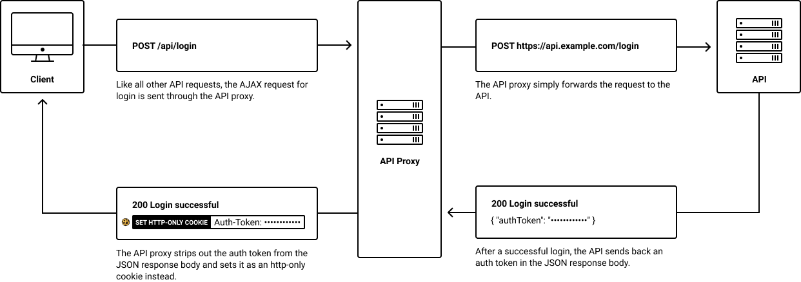
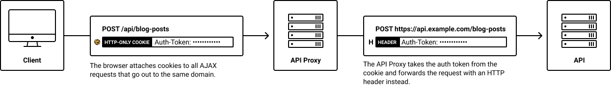

<!-- #todo complete this -->

# Http Proxy Server

#### Instead of calling the API directly, our AJAX calls will go through an API Proxy – basically a thin layer in front of the actual API.

#### The API Proxy will exist on the same host/domain as our Next.js app and act as a sort of "translation layer". By existing on the same domain as our Next.js app, it can access the same cookies. So it can read the HTTP-only auth token cookie and "translate" it into an auth-token HTTP header that the API understands.

#### This API Proxy basically has two jobs:

### 1. Setting the Auth Token Cookie After Session Call

### Whenever an API gets called,In case the request is to session/start, the API Proxy needs to intercept the API's response to strip out and the token it contains and set it as an HTTP-only cookie.



### 2. Switching Out the Cookie for an HTTP Header

#### Most APIs don't accept cookies for authentication themselves so we'll have our API Proxy "translate" our authentication cookies into HTTP headers before forwarding our requests to the actual API.



### know let's see what implementation look like

## [here](../pages/api/proxy/[...path].js) we have:

```
export const config = {
  api: {
    bodyParser: false,
  },
};

export default (req, res) => {
  return new Promise((resolve, reject) => {
    const pathname = url.parse(req.url).pathname;
    const isSessionStart = pathname === proxyBasePath + "/session/start";

    const token = Cookies.get(TOKEN_COOKIE_KEY, { req, res });

    req.url = req.url.replace(proxyBasePathRegExp, "");

    req.headers.cookie = "";

    if (token) req.headers[headerTokenKey] = token;

    if (isSessionStart) proxy.once("proxyRes", interceptSessionResponse);

    proxy.once("error", reject);

    proxy.web(req, res, {
      target: externalApiBaseURL,
      autoRewrite: false,
      // selfHandleResponse: isSessionStart,
    });
    function interceptSessionResponse(proxyRes, req, res) {
      let apiResponseBody = "";
      proxyRes.on("data", (chunk) => {
        apiResponseBody += chunk;
      });
      proxyRes.on("end", () => {
        try {
          const response = JSON.parse(apiResponseBody);

          const token = response?.result?.session?.token;
          Cookies.set({ req, res }, TOKEN_COOKIE_KEY, token, {
            httpOnly: true,
            sameSite: "lax",
          });
          res.status(200).json(response?.result);
          resolve(response);
        } catch (err) {
          reject(err);
        }
      });
    }
  });
};
```

- By skipping the bodyParser, we can just stream all requests through to the actual API.
- We'll also set the SameSite attribute to 'lax' for some additional CSRF protection.
