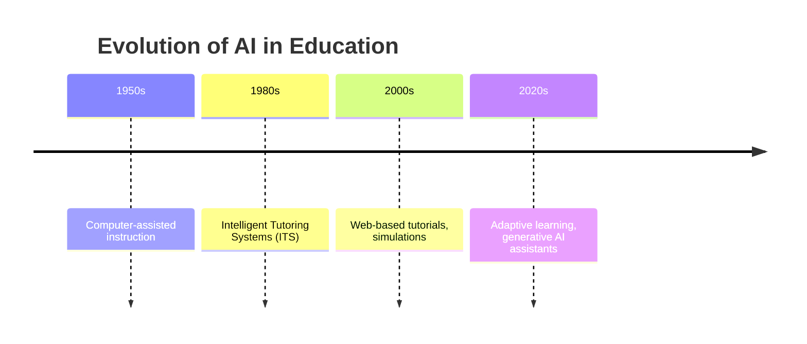

## Introduction

Artificial intelligence (AI) is no longer a futuristic concept — it’s embedded in our daily lives. Tools like ChatGPT, Copilot, and Gemini are rewriting how we approach communication, coding, and creativity. In higher education, the rise of AI has sparked one of the most pressing debates of our time:

👉 _Will AI replace teachers, or will it become their indispensable assistant?_

On one hand, AI systems can automate grading, track student performance, and deliver personalized content at scale. On the other, no algorithm can replicate the empathy of a mentor, the cultural awareness of a seasoned educator, or the spark of curiosity ignited by a passionate teacher.

This post explores the historical roots, current realities, and future possibilities of AI in education — and argues for a **synergy model** where humans and AI collaborate to elevate learning.

## Historical Context: AI’s Early Role in Education

AI in education isn’t new — its story began decades ago.

- **1950s:** Early “teaching machines” introduced computer-assisted instruction, offering programmed lessons on screens. These systems were basic but revolutionary, moving education beyond textbooks.
- **1980s:** Intelligent Tutoring Systems (ITS) emerged. They could adapt questions based on student responses, offering a glimpse of personalized learning.
- **2000s:** With the internet, web-based tutorials, simulations, and gamified learning flourished. Students could now learn interactively at home.
- **2020s:** Generative AI arrived, with systems like ChatGPT and Khan Academy’s _Khanmigo_ providing conversational tutoring and real-time feedback.

The trajectory shows one thing clearly: **AI has consistently evolved as an assistant, not a replacement.**

## Current Applications of AI in Higher Education

Today, AI is integrated into classrooms worldwide in practical, often invisible ways:

- **Adaptive Learning Platforms**
  Tools like _DreamBox_ and _Smart Sparrow_ adjust content difficulty based on performance, giving each student a personalized learning path.

- **AI Tutors**

  - _Duolingo’s AI Coach_ uses natural language processing to teach languages interactively.
  - _Khanmigo_, Khan Academy’s chatbot, helps students brainstorm essays, solve problems, and practice dialogue.

- **Automated Grading & Feedback**
  AI systems grade multiple-choice exams, flag inconsistencies, and even provide writing feedback. _Turnitin_ now detects AI-written content as well.

- **Virtual Teaching Assistants**
  Georgia Tech famously introduced _Jill Watson_, an AI assistant that answered student queries in an online forum. Students didn’t realize Jill wasn’t human until the end of the course — highlighting AI’s potential in scaling support.

- **Administrative Support**
  Attendance tracking, student performance dashboards, and scheduling are increasingly AI-driven, freeing teachers to focus on pedagogy.

These applications illustrate the spectrum: from back-office support to direct tutoring.

## Potential Advantages of AI in Education

The appeal of AI in higher education lies in three main benefits:

1. **Efficiency in Administrative Tasks**
   Teachers often juggle paperwork, attendance, grading, and compliance. AI automates these repetitive processes, allowing educators to reinvest time into mentorship and curriculum design.

2. **Personalized Learning**
   Unlike “one-size-fits-all” lectures, AI systems can track progress, identify weaknesses, and adapt learning paths. For example, in language learning, students receive instant pronunciation feedback — something hard to scale with human-only teaching.

3. **24/7 Availability**
   AI tutors never sleep. For international students in different time zones or learners who prefer late-night study, AI ensures round-the-clock support.

4. **Accessibility for Diverse Needs**
   AI-driven transcription tools help hearing-impaired students; machine translation supports multilingual classrooms. AI broadens education’s reach.

   ## Limitations of AI: Where Humans Excel

Despite its promise, AI is far from replacing teachers. Its weaknesses highlight why educators remain central:

- **Lack of Emotional Intelligence**
  AI cannot read a student’s anxiety before an exam or comfort someone after failure. Emotional intelligence is essential to student growth.
- **Cultural and Ethical Blind Spots**
  Algorithms can’t navigate cultural nuances or moral dilemmas. Teachers guide students through complex social contexts.
- **Holistic Development**
  Critical thinking, creativity, and teamwork require human interaction. Students don’t just absorb information; they learn how to collaborate, debate, and innovate.
- **Academic Integrity Concerns**
  With ChatGPT, plagiarism detection has become trickier. Teachers now balance integrating AI literacy with maintaining standards of originality.

A telling example: while ChatGPT can generate an essay outline, it cannot **coach a student through the frustration of writer’s block** — a teacher’s role remains irreplaceable.

## Unique Strengths of Human Teachers

Why can’t AI replace teachers? Because educators bring qualities no machine can replicate:

- **Emotional & Interpersonal Skills** → empathy, encouragement, conflict resolution.
- **Cultural Sensitivity** → adapting lessons for diverse contexts.
- **Mentorship & Career Guidance** → advising students beyond academics.
- **Inspiration** → sparking passion through storytelling, curiosity, and real-world wisdom.
- **Community Building** → bridging families, communities, and institutions.

These qualities form the heart of education — developing humans, not just workers.

## Survey Findings: What Do Students & Teachers Think?

A recent study surveyed **384 students and 144 teachers** from Hong Kong universities to gauge perceptions of AI in education. The results were telling:

- **Integration of AI:**
  Students were more open to AI than teachers, though both acknowledged its benefits.
- **Academic Performance:**
  Students believed AI could improve grades and writing skills; teachers were cautious.
- **Replacement Fears:**
  Neither group strongly believed AI would replace teachers. Human interaction remained non-negotiable.
- **Concerns:**
  Teachers worried about transferable skills (critical thinking, creativity). Both groups noted AI’s limitations in holistic development.

| Perspective                     | Students | Teachers |
| ------------------------------- | -------- | -------- |
| Open to AI Integration          | High     | Moderate |
| Believe AI Improves Performance | Yes      | Mixed    |
| Fear of Replacement             | Low      | Low      |
| Concerned about Holistic Skills | Moderate | High     |

**Key Insight:** Both groups see AI as an assistant, not a replacement — but teachers are more cautious about long-term risks.

## Collaboration Between AI and Teachers

The most promising vision of AI in education isn’t _either/or_, but _both/and_:

- **Complementary Strengths** → AI handles repetitive, data-driven tasks; teachers focus on higher-order skills like mentoring, ethics, and creativity.
- **Enhanced Learning Outcomes** → Studies show blended models (AI + teachers) outperform AI-only or teacher-only setups.
- **Practical Example** → In flipped classrooms, AI provides practice and feedback before class, while professors guide discussions and critical thinking during class time.

This model mirrors workplaces, where humans and AI increasingly collaborate rather than compete.

## Practical Roadmap for the Future

For this partnership to succeed, stakeholders must act intentionally:

**For Teachers**

- Embrace AI tools for grading, planning, and feedback.
- Focus on uniquely human skills: empathy, adaptability, mentorship.
- Commit to continuous professional development in AI literacy.

**For Students**

- Develop AI literacy: learn to use AI responsibly, ethically, and creatively.
- Avoid over-reliance: use AI as a tool, not a crutch.
- Blend AI support with critical thinking and personal reflection.

**For Universities**

- Integrate AI across curricula, not as an add-on.
- Provide clear policies on plagiarism, responsible AI use, and fairness.
- Offer training programs for both faculty and students to navigate AI in learning.

## Conclusion: The Synergy Model

AI in education is here to stay. But the evidence, from history to modern classrooms, shows a clear truth:

- AI is powerful in automating, scaling, and personalizing.
- Teachers are irreplaceable in mentoring, inspiring, and guiding.
- The future lies not in replacement, but in synergy.

The AI revolution in education doesn’t spell the end of teaching. Instead, it offers a future where technology and humanity collaborate — where machines handle routine work, and teachers focus on the art of human growth.
